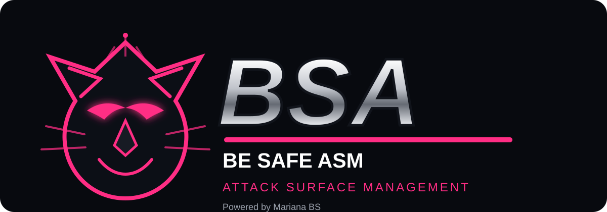

# BSA — Be Safe ASM

<p align="center">
  
</p>

<p align="center">
  <strong>External Attack Surface Management • Continuous Discovery • Exposure Prioritization</strong><br>
  <sub>Powered by Mariana BS</sub>
</p>

---

## O que é o BSA?

O **BSA (Be Safe ASM)** é a plataforma de **Attack Surface Management** da Be Safe, criada para descobrir, correlacionar, contextualizar e priorizar ativos expostos à Internet.

A proposta é ir além de uma lista de IPs e domínios: o BSA mantém um **inventário vivo da superfície de ataque**, registra evidências, identifica mudanças e transforma exposição técnica em uma fila de ação defensiva.

> O princípio é simples: **descobrir como um atacante enxerga a organização, mas entregar o resultado com governança, rastreabilidade e validação humana.**

## Primeira versão

Esta base inicial já nasce preparada para:

- descoberta de domínios, subdomínios, IPs e serviços;
- inventário externo com estado, criticidade e origem da evidência;
- findings com severidade, confiança e ciclo de vida;
- score de exposição explicável;
- dashboard preto + rosa da Be Safe;
- histórico de mudanças da superfície;
- arquitetura pronta para collectors assíncronos;
- API REST;
- Docker;
- trilha futura para CTEM, brand monitoring, cloud exposure e integrações SIEM/SOAR/ITSM.

## Arquitetura

```text
                    ┌────────────────────────────┐
                    │       BSA Web Console      │
                    │    Black / Pink / PT-BR    │
                    └─────────────┬──────────────┘
                                  │
                           REST API / FastAPI
                                  │
              ┌───────────────────┼───────────────────┐
              │                   │                   │
       Asset Inventory      Exposure Engine      Change Engine
              │                   │                   │
              └───────────────────┼───────────────────┘
                                  │
                         Collector Framework
                                  │
         ┌──────────────┬─────────┼─────────┬──────────────┐
         │ DNS / RDAP   │ TLS/HTTP│ Ports   │ CT / Passive │
         └──────────────┴─────────┴─────────┴──────────────┘
```

## Roadmap técnico

### Fase 1 — Foundation
Inventário, API, dashboard, evidências, score e normalização.

### Fase 2 — Discovery Engine
DNS, RDAP/WHOIS, Certificate Transparency, HTTP/TLS, portas expostas, fingerprints e relacionamento entre ativos.

### Fase 3 — Intelligence
Shadow IT, dangling DNS, certificados, takeover signals, serviços administrativos, exposição de cloud, mudanças de ASN/IP e correlação de risco.

### Fase 4 — Operations
Workflows, responsáveis, SLA, exceções, comentários, reteste, Jira/GLPI/Freshservice, webhooks e exportações.

### Fase 5 — BSA Intelligence Graph
Grafo de ativos e relacionamentos, confiança por evidência, descoberta recursiva controlada e priorização baseada em contexto.

## Princípios de segurança

O BSA será orientado à **descoberta e validação defensiva de ativos autorizados**. A plataforma deve privilegiar técnicas passivas e probes seguros, com limites de execução, identificação da origem das evidências e escopo explicitamente configurado.

## Executar

```bash
docker compose up --build
```

Console: `http://localhost:8080`  
API: `http://localhost:8000`  
Swagger: `http://localhost:8000/docs`

---

**BSA • Be Safe ASM**  
**Powered by Mariana BS**
